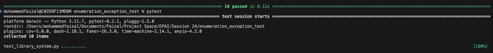

# Enumerations & Exceptions

## Introduction

This Python-based library system demonstrates the use of **Enumerations**, **Custom Exceptions**, and **Exception Handling** to manage books, genres, library members, and their membership levels. The system allows users to borrow and return books while also calculating membership fees and handling exceptions like unavailable books, invalid membership levels, and late returns.

## Features

### 1. **Enumerations**

The library system uses **Enumerations** (`Enum`) to handle the genres of books and different membership levels. This provides a more structured way of managing predefined values for genres and membership levels.

**Book Genre Enum:**

```python
from enum import Enum, auto

class BookGenre(Enum):
    FICTION = auto()
    NON_FICTION = auto()
    SCIENCE = auto()
    HISTORY = auto()
    BIOGRAPHY = auto()
```

- The `BookGenre` enum defines different genres using `auto()` which auto-generates unique values for each genre (e.g., `FICTION = 1`, `NON_FICTION = 2`).
- `auto()` ensures the values are unique and automatically assigned.

**Membership Level Enum:**

```python
class MembershipLevel(Enum):
    BASIC = 100
    PREMIUM = 200
    GOLD = 500
```

- The `MembershipLevel` enum assigns specific monetary values to different membership levels.
- `BASIC`, `PREMIUM`, and `GOLD` levels are associated with membership fees of 100, 200, and 500, respectively.

### 2. **Custom Exceptions**

The system utilizes custom exceptions to manage specific error scenarios, improving error handling and user experience.

**Custom Exceptions:**

```python
class BookNotAvailableError(Exception):
    """Raised when the requested book is not available for borrowing."""
    pass

class InvalidMembershipError(Exception):
    """Raised when an invalid membership level is provided."""
    pass

class LateReturnError(Exception):
    """Raised when a book is returned late."""
    pass
```

- **`BookNotAvailableError`**: Raised when a user tries to borrow a book that is not available.
- **`InvalidMembershipError`**: Raised when a user is assigned an invalid membership level.
- **`LateReturnError`**: Raised when a book is returned late.

### 3. **Book Class**

The `Book` class represents a book in the library. It provides methods to borrow and return books, including handling the error cases when a book is unavailable or returned late.

**Book Class Implementation:**

```python
class Book:
    def __init__(self, title: str, genre: BookGenre, is_available: bool = True):
        self.title = title
        self.genre = genre
        self.is_available = is_available

    def borrow(self) -> None:
        if not self.is_available:
            raise BookNotAvailableError(f"The book '{self.title}' is not available.")
        self.is_available = False

    def return_book(self, is_late: bool = False) -> None:
        if is_late:
            raise LateReturnError(f"The book '{self.title}' was returned late.")
        self.is_available = True
```


- The `borrow()` method checks whether the book is available. If not, it raises a `BookNotAvailableError`.
- The `return_book()` method marks the book as available again. If the book is returned late, it raises a `LateReturnError`.

### 4. **Member Class**

The `Member` class represents a library member and includes methods to manage membership levels and calculate fees.

**Member Class Implementation:**

```python
class Member:
    def __init__(self, name: str, membership_level):
        self.name = name
        self.membership_level = membership_level

    def get_fee(self) -> int:
        if not isinstance(self.membership_level, MembershipLevel):
            raise InvalidMembershipError(f"'{self.membership_level}' is not a valid MembershipLevel.")
        return self.membership_level.value
```

- The `get_fee()` method retrieves the fee associated with the member's membership level.
- If the membership level is invalid, it raises an `InvalidMembershipError`.

---

## Usage Example

Here’s an example demonstrating how the system works, including borrowing and returning books, and handling membership fees:

```python
# Create books
book1 = Book("The Great Gatsby", BookGenre.FICTION)
book2 = Book("A Brief History of Time", BookGenre.SCIENCE)

# Borrow a book
try:
    book1.borrow()
    print(f"'{book1.title}' has been borrowed.")
except BookNotAvailableError as e:
    print(e)

# Try to return a book late
try:
    book1.return_book(is_late=True)
except LateReturnError as e:
    print(e)

# Create a member
try:
    member = Member("Alice", MembershipLevel.PREMIUM)
    print(f"Membership fee for {member.name}: {member.get_fee()}")
except InvalidMembershipError as e:
    print(e)
```

### Output:

```bash
'The Great Gatsby' has been borrowed.
The book 'The Great Gatsby' was returned late.
Membership fee for Alice: 200
 
- A member named "Alice" with a `PREMIUM` membership borrows and returns books.
- If the book is returned late, a `LateReturnError` is raised.
- The membership fee is retrieved using the `get_fee()` method.

---

## Tests

The system includes unit tests to ensure the functionality works as expected.
Here are the test cases covered in the system:

### Test Cases

1. **Successful Book Borrow**
   - Test case to check if a book can be borrowed successfully when it is available.
   ```python
   def test_book_borrow():
       book = Book("1984", BookGenre.FICTION, True)
       book.borrow()
       assert book.is_available == False
   ```

2. **Borrowing an Unavailable Book**
   - Test case to ensure a `BookNotAvailableError` is raised when attempting to borrow a book that is not available.
   ```python
   def test_book_already_borrowed():
       book = Book("1984", BookGenre.FICTION, False)
       with pytest.raises(BookNotAvailableError):
           book.borrow()
   ```

3. **Returning a Book Late**
   - Test case to ensure a `LateReturnError` is raised when a book is returned late.
   ```python
   def test_book_return_late():
       book = Book("Sapiens", BookGenre.HISTORY, False)
       with pytest.raises(LateReturnError):
           book.return_book(is_late=True)
   ```

4. **Returning a Book on Time**
   - Test case to check that a book can be returned successfully on time (not late).
   ```python
   def test_book_return_on_time():
       book = Book("Sapiens", BookGenre.HISTORY, False)
       book.return_book(is_late=False)
       assert book.is_available == True
   ```

5. **Membership Fee for PREMIUM**
   - Test case to verify the correct membership fee for a "PREMIUM" membership level.
   ```python
   def test_membership_fee_premium():
       member = Member("Alice", MembershipLevel.PREMIUM)
       assert member.get_fee() == 200
   ```

6. **Membership Fee for BASIC**
   - Test case to verify the correct membership fee for a "BASIC" membership level.
   ```python
   def test_membership_fee_basic():
       member = Member("Bob", MembershipLevel.BASIC)
       assert member.get_fee() == 100
   ```

7. **Invalid Membership Level**
   - Test case to ensure an `InvalidMembershipError` is raised when an invalid membership level is provided.
   ```python
   def test_invalid_membership():
       member = Member("Eve", "INVALID_LEVEL")
       with pytest.raises(InvalidMembershipError):
           member.get_fee()
   ```

8. **Automatic Values in BookGenre**
   - Test case to check the automatic values assigned to the `BookGenre` enum.
   ```python
   def test_book_genre_values():
       assert BookGenre.FICTION.value == 1
       assert BookGenre.NON_FICTION.value == 2
   ```

9. **Custom Values in MembershipLevel**
   - Test case to verify the custom values assigned to the `MembershipLevel` enum.
   ```python
   def test_membership_level_values():
       assert MembershipLevel.BASIC.value == 100
       assert MembershipLevel.PREMIUM.value == 200
       assert MembershipLevel.GOLD.value == 500
   ```

10. **Borrow and Return Lifecycle**
    - Test case to ensure that a book can be borrowed and then returned successfully.
    ```python
    def test_borrow_and_return():
        book = Book("Cosmos", BookGenre.SCIENCE, True)
        book.borrow()
        assert book.is_available == False
        book.return_book(is_late=False)
        assert book.is_available == True
    ```
---

### Running Tests

To run the tests, use the following command:

```bash
pytest -v
```

## Test Results

